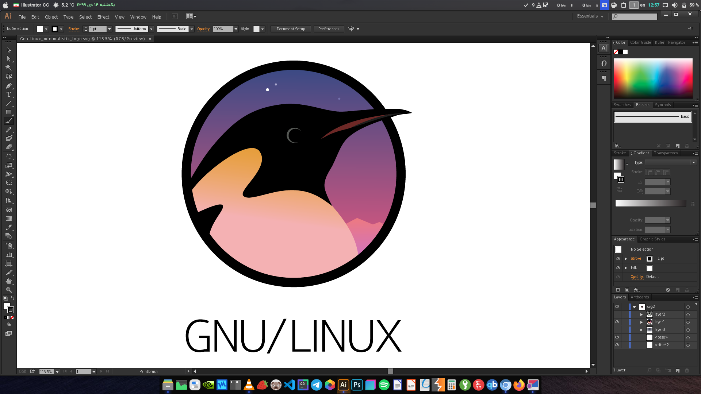
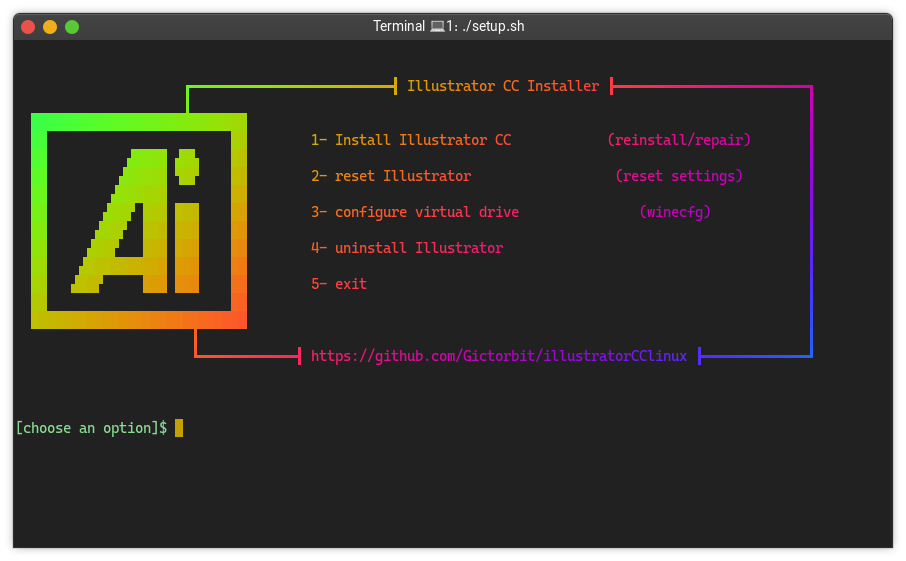

<div align="center" class="tip" markdown="1" style>



    
</div>

</div>

# Illustrator CC Installer for Linux
This bash script helps you to install `Adobe Illustrator CC` on your Linux distro easily. It will download a free version of Illustrator and tries to run it using `wine` installed on your system

## :rocket: Features
* illustrator command
* desktop entry
* wine dark mode
* supports graphic cards like (`intel`, `Nvidia`)
* saves the downloaded files in your cache directory
* It's free and you will not need any license key
* works on any Linux distribution


## :warning: Requirements
1- use a 64bit edition of your distro

2-make sure the following packages are already installed on your Linux distro
* `wine`
* `md5sum`


if they are not already installed you can install them using your package manager for example in arch Linux
```bash
sudo pacman -S wine
``` 
3- make sure you have enough storage in your `/home` partition about `2 GiB`
> 400 MiB will be free after installation

also you can install illustrator in diffrent directory

4- make sure you have an internet connection and about `400 Mib` traffic to download illustrator

## :computer: Installation

the installer scripts use a virtual drive of wine and makes a new `winprefix` for illustrator

first of all, you need to clone the repository with this command:
```bash
git clone https://github.com/Gictorbit/illustratorCClinux.git
cd illustratorCClinux
chmod +x setup.sh
./setup.sh
```
then you can easily run `setup.sh` script to install illustrator cc on your Linux distro

<div align="center" class="tip" markdown="1" style>



</div>

you can use `-d` to specify the installation path, and `-c` for the cache directory.
for example:

```bash
cd scripts
chmod +x illustratorSetup.sh
./illustratorSetup.sh -d /mnt/storage/illustratorSetup.sh
```
or with c flag
```bash
./illustratorSetup.sh -d /mnt/myfiles/illustrator -c /mnt/cache
```
when no options are given, the installer script will use the default path, 
the uninstaller script and others will detect your custom path so there is no problem,
I recommend using the `-d` option and having the default cache directoy


## :wine_glass: wineprefix Configuration
if you need to configure the wineprefix of illustrator you can use `winecfg.sh` script just run the command below
```bash
chmod +x winecfg.sh
./winecfg.sh
```

## :hotsprings: Uninstall
to uninstall illustrator you can use the uninstaller script with commands below

```bash
chmod +x uninstaller.sh
./uninstaller.sh
```
---
<a href="https://poshtiban.com">
</a> 

<a href="https://github.com/Gictorbit/photoshopCClinux">

</a>